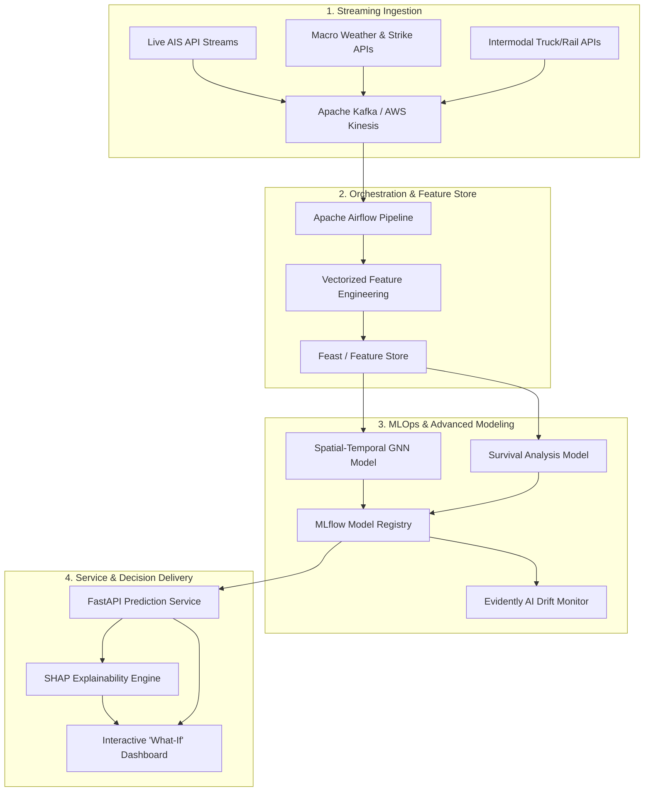

# US Vessel Dwell Time Prediction Pipeline
### *An Enterprise-Grade Spatial-Temporal Machine Learning & Analytics Framework*

This repository implements an end-to-end Machine Learning pipeline and interactive 3D spatial analytics dashboard to predict remaining dwell times (wait-to-berth hours) for approaching vessels in US waterways.

---

## 1. Project Overview & Business Value

In global maritime supply chains, port congestion represents a multi-billion dollar bottleneck. Shipping lines, cargo owners, and trucking networks lose significant capital due to unpredictable wait times (dwell times) at terminals, leading to idle drayage labor, stockouts, and steep demurrage fees.

This project implements an **enterprise-ready data science solution** to:
1.  **Automatically discover** the busiest maritime ports and terminals.
2.  **Model dynamic port congestion** based on localized spatial ship densities.
3.  **Predict remaining time-to-berth** for approaching vessels, enabling logistics teams to coordinate just-in-time warehouse labor and truck dispatching.

---

## 2. Dataset

The pipeline operates on **6.9 million records** (750MB) of Automatic Identification System (AIS) tracking data collected by the **US Coast Guard (USCG)** on January 10, 2017. 
*   **Attributes**: Vessel identifier (`MMSI`), timestamp (`BaseDateTime`), kinematics (`LAT`, `LON`, `SOG`, `COG`, `Heading`), specifications (`VesselName`, `Length`, `Width`, `Draft`, `VesselType`), and navigational cargo categories.

---

## 3. Architecture & Modularity

The project is structured following clean production engineering principles:

```
port_congestion_predictor/
│
├── data/
│   ├── port_registry.csv         # Discovered port registry centers
│   └── processed_features.csv    # Final modeling dataset with engineered features
│
├── models/
│   ├── best_model.pkl            # Trained Random Forest regressor binary
│   └── model_metadata.pkl        # Feature definitions and global importances
│
├── src/
│   ├── data_processing.py        # Port discovery, vectorized feature extraction
│   └── modeling.py               # Model training and regional evaluation
│
├── app.py                        # Streamlit web dashboard
├── requirements.txt              # Project python library dependencies
└── test_pipeline.py              # Portable automated validation checks
```

---

## 4. Key Methodology & Features

### A. Grid-Based Density Port Discovery
Instead of hardcoding port centroids, the pipeline performs automated **grid-based spatial density grouping** on coordinates where vessels report a stationary status (`Status == 5.0` or speed `< 0.5` knots). By grouping coordinates rounded to `0.1` decimal degrees (~11km grids), the pipeline automatically registers the **top 15 busiest port zones** in the dataset (e.g. Houston, Miami, Seattle, New York, New Orleans, San Diego, and Vancouver).

### B. Vectorized Spatial-Temporal Feature Engineering
To handle 6.9 million pings efficiently, features are calculated using **vectorized NumPy matrix broadcasting** to eliminate slow loops:
*   **Distance to Port (`dist_to_port`)**: Vectorized Haversine distance from the vessel to its closest port centroid.
*   **Port Congestion Index (`port_total_density`)**: Active (SOG $\ge$ 0.5) and stationary (SOG < 0.5) unique vessel counts within a 50km radius of each port center, grouped in 10-minute intervals.
*   **Draft Ratio (`draft_ratio`)**: Calculated as `Draft / Length` to serve as a proxy for vessel cargo loading density.
*   **Target Generation (`dwell_time`)**: Remaining hours for a transit ship until it first registers a docked status (`Status == 5.0`) in the port zone.

### C. Preventing Data Leakage
To ensure realistic model generalization, train/test splitting is grouped by **Vessel ID (`MMSI`)**. Evaluating on a test set consisting of **completely unseen ships** ensures the model learns real maritime traffic behaviors rather than overfitting to specific ship paths.

---

## 5. Machine Learning Models & Evaluation

The pipeline trains and compares two robust tree-based estimators on **79,639 records** across **15 ports**:

| Metric | LightGBM Regressor | Random Forest Regressor (Best Model) |
| :--- | :--- | :--- |
| **RMSE** | 5.5880 hours | **4.8002 hours** |
| **MAE** | 4.0932 hours | **3.5100 hours** |
| **R² Score** | -0.1554 | **+0.1474 (14.74%)** |

### Findings:
*   **Random Forest** achieved a positive $R^2$ score of **14.74%**, meaning it successfully predicts wait times for unseen ships entering unfamiliar port zones.
*   **`hour`** (time of day) and **`draft_ratio`** (cargo capacity proxy) were the top two most important features.

---

## 6. Installation & Usage

Ensure you have Python 3.10+ installed.

### 1. Install Dependencies
```bash
pip install -r requirements.txt
```

### 2. Run Data Processing
```bash
# Processes raw data and automatically discovers port zones
python src/data_processing.py --raw-path "/path/to/raw/AIS_2017_01_10.csv"
```

### 3. Train the Model
```bash
python src/modeling.py
```

### 4. Run Verification Tests
```bash
python test_pipeline.py
```

### 5. Launch the Dashboard
```bash
python -m streamlit run app.py
```

---

## 7. Enterprise Production & MLOps Architecture (MathCo Blueprint)

To scale this framework into a production-grade analytics engine matching enterprise consulting standards (e.g. **TheMathCompany** client delivery), the system design maps to the following architecture:



### 📊 Four Pillars of Enterprise Refinement

### 1. Advanced Supply Chain Context (Feature Engineering)
Standard machine learning models rely purely on historical coordinates. To make this industry-grade, the feature store should ingest:
*   **Real-time AIS Specifications**: Dynamic drafts and headings to gauge precise arrival corridors.
*   **Port Constraints**: Integration of berth occupancy schedules, crane operating capacity, and labor union shifts (weekend vs. weekday work slowdowns).
*   **Macro Disruptions**: Flag features representing seasonal rushes (e.g. Chinese New Year peak shipping), labor strikes, and regional weather anomalies (typhoons, high winds).
*   **Intermodal Landside Backlogs**: Downstream constraints such as truck turn times, chassis availability, and rail yard dwell times to identify landside container bottlenecks.

### 2. Upgraded Model Architecture (Decision Science)
*   **Spatial-Temporal Graph Networks**: Ports do not operate in isolation. A **Graph Neural Network (GNN)** should model spatial connections, demonstrating how congestion in one key hub (e.g., Shanghai) cascades down to destination ports (e.g., LA/Long Beach) weeks later.
*   **Time-Series Deep Learning**: LSTM (Long Short-Term Memory) or Temporal Fusion Transformers (TFT) to capture multi-scale seasonal trends.
*   **Survival Analysis**: Frame the prediction target not simply as a regression problem, but as a survival curve (Cox Proportional Hazards) calculating the *probability* of a vessel remaining stuck at anchorage beyond $X$ hours.

### 3. Enterprise MLOps & Productionization
*   **Streaming Pipelines**: Transition from static file processing to an event-driven stream using **Apache Kafka** or **AWS Kinesis** to ingest live vessel coordinates.
*   **Workflow Orchestration**: Wrap the data extraction, cleaning, and modeling steps into an automated pipeline using **Apache Airflow** or **Prefect**.
*   **Drift Monitoring**: Implement **Evidently AI** and **MLflow** to monitor data drift and feature shifts, automatically alerting engineers and triggering model retraining when global shipping lanes change.

### 4. Business Value Delivery (Explainable AI & Simulation UI)
*   **Explainable AI (XAI)**: Integrate **SHAP** directly into the interface. A terminal operator needs to understand *why* the model predicts a 48-hour delay (e.g. is it driven by local wind speeds or terminal queue congestion?).
*   **Interactive 'What-If' Simulation**: Extend the Streamlit application to allow logistics managers to run scenario planning:
    > *"If we reroute Vessel A to Terminal 3 instead of Terminal 1, how does the total port dwell time change?"*

---

## 8. License

This project is licensed under the MIT License.
